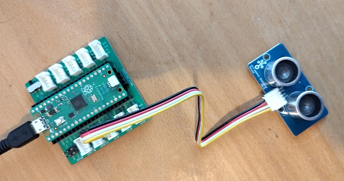

# Pico Ultrasonic Ranger
This is a driver for the [Grove Ultrasonic Distance Sensor](https://www.seeedstudio.com/Grove-Ultrasonic-Distance-Sensor.html) 
which is developed for [Raspberry Pi Pico BSP  by Jeremy Grosser](https://pico-doc.synack.me/). 
It may work with similar ultrasonic rangers from Adafruit or Sparkfun but I have tested this only with the Grove version. 

## Usage 
A working example is contained in the tests folder. 

The basic steps are that you first create an instance of the package with an GPIO to be used for the communication with the sensor:

       package Ranger is new Pico_Ultrasonic_Ranger (GPIO => Pico.GP16'Access);

Then you start measuring. Returned is the distance in millimeters and the success status:

      Ranger.Measure (Distance, Success);
      if Success then
         --  If the distance is below 300mm then set the LED on.
         if Distance < 300 then 
            Pico.LED.Set;
         else
            Pico.LED.Clear;
         end if;
      end if;

## Acklowledgements

The implementation is based on [Seeedstudios Ultrasonic Ranger Library](https://github.com/Seeed-Studio/Seeed_Arduino_UltrasonicRanger/) for the Arduino. 

